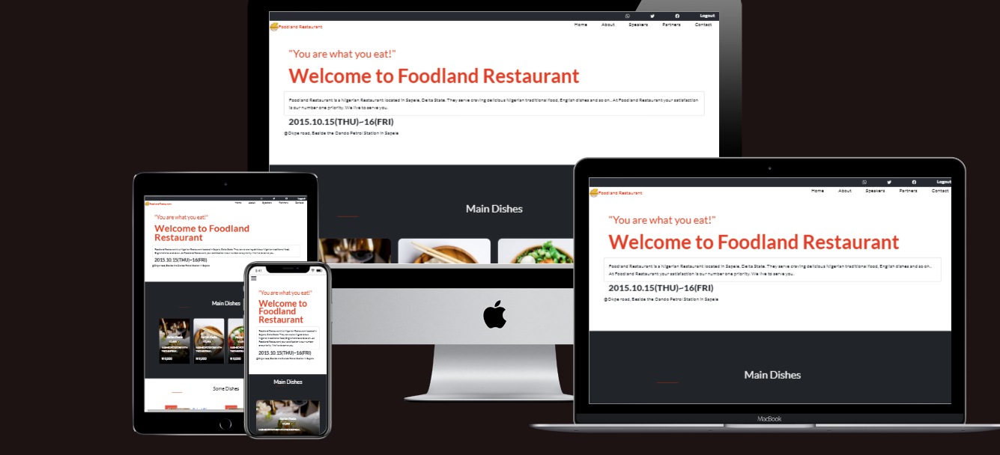

# First Capstone Project: Responsive Restaurant Website



> This is my capstone project built with HTML-CSS-BOOTSTRAP-JAVASCRIPT. My love for restaurants made me develop this project along that line. The website is about a popular restuarant called Foodland restaurant. It features a list of dishes, an about page and partner sections. Please have a look at the live demo and let me know what you think 😊.

## Learning Objectives 🔖

- Use semantic HTML tags.
- Apply best practices in HTML code.
- Use CSS selectors correctly.
- Use CSS box model.
- Use Flexbox to place elements in the page.
- Demonstrate ability to create UIs
- adaptable to different screen sizes using media queries.
- Use GitHub Pages to deploy web pages.
- Apply JavaScript best practices and language style guides in code.
- Use JavaScript to manipulate DOM elements.
- Use JavaScript events.
- Use objects to store and access data.
- Communicate technical concepts to other technical people.

## Project Documentation

- Here is a link to my loom video [Project description video](https://www.loom.com/share/09d096e5d43442dab33e23fe8e41cae4)


## Built With

- HTML
- CSS
- Bootstrap
- JavaScript.
- Linters: Lighthouse, Webhint, Stylelint and ESlint
- Code Editor: VS Code

## LIVE DEMO

[Live Demo Link](https://elijahdre.github.io/Capstone-one/)

## Getting Started

you can clone the repository by using the command below and run the "npm install" command to install the necessary tools

[`git clone git@github.com:Elijahdre/Capstone-one.git`](git@github.com:Elijahdre/Capstone-one.git)

### Setup

```cmd
git clone git@github.com:Elijahdre/Capstone-one.git
cd ./Capstone-one
npm install
npm run build
npm start
```

If you are non a technical person you can download the zip file.

- To do that you have to go to the green button that says 'Code' and then press on it.
- Choose the option 'Download Zip' and wait until it download.
- Then you need to decompress it.
- You will need to have Zip compress file software installed in your computer. If you don't have it you can download it from here
  [`https://www.7-zip.org/download.html`](https://www.7-zip.org/download.html)
- Do double click on the Capstone-1.zip and choose a folder where to place all the decompressed files.
- Once you are done decompressing, you can open the created folder.
- In it you can double click on the index.html file and choose a browser to open it (For example google Chrome Browser).
- Now you should be able to see the project.
- Remember to use the mouse to navigate through the website. Also you can use the keys 'arrow up' and 'arrow down' of your keyboard
  to scroll up and down.

## Author

👤 **Elijah Odjegba**

- GitHub: [](https://github.com/elijahdre)
- Twitter: [](https://twitter.com/elijahdre)
- LinkedIn: [](https://www.linkedin.com/in/elijah-odjegba/)


## 🤝 Contributing

Contributions, issues, and feature requests are welcome!

Feel free to check the [issues page](https://github.com/Elijahdre/Capstone-one/issues).

## Show your support

Give a ⭐️ if you like this project!

## Acknowledgments
- [Microverse](https://www.microverse.org/)

- [Cindy Shin](https://www.behance.net/gallery/29845175/CC-Global-Summit-2015) from who I got my inspiration
- A great thanks to My coding partners, morning session team, and standup team Partners for their contributions.
- Thanks to Code Reviewers for the insightful feedback.

## 📝 License

This project is [MIT](./MIT.md) licensed.
